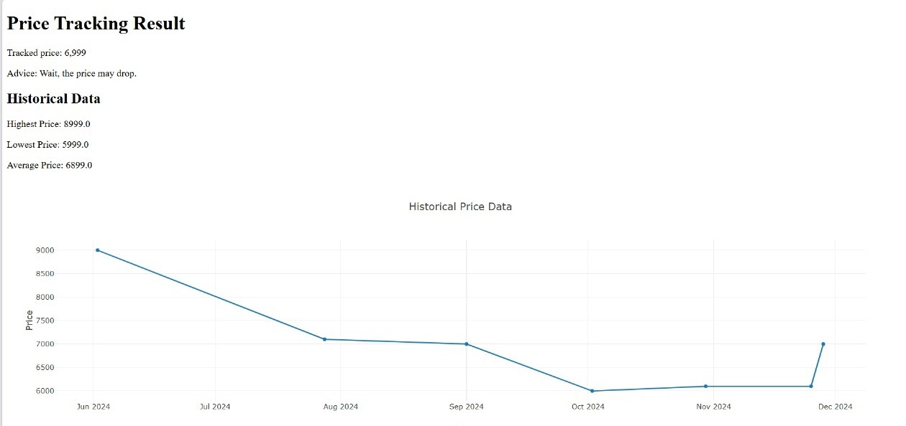

# EcomTrack 📊🛍️  

## Overview  
EcomTrack is an **eCommerce price tracker and buying adviser** that helps users monitor product prices, store historical price data, visualize trends, and receive smart purchase recommendations.  

## Features  
✅ Track real-time product prices using direct links  
✅ Store historical price data in a database or CSV  
✅ Continuously update price history with new entries  
✅ Visualize price trends with lowest, highest, and average prices  
✅ Get smart buying suggestions (e.g., *Buy Now* or *Wait for a price drop*)  

## How It Works  
1️⃣ **User enters the product link.**  
2️⃣ The system fetches the **current price** from eCommerce sites.  
3️⃣ Historical prices are stored and updated continuously.  
4️⃣ A graphical visualization displays **price trends** over time.  
5️⃣ Based on trends, the system suggests whether to buy now or wait.  

## 📸 Example Output  

### **Price Trend Graph 📈**  
  

### **Buying Recommendation ✅**  
  

## Installation  
1. Clone the repository:  
   ```bash
   git clone https://github.com/samruddhi0023/EcomTrack.git
